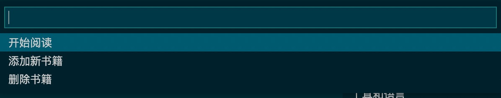
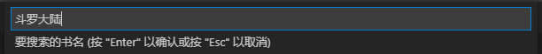
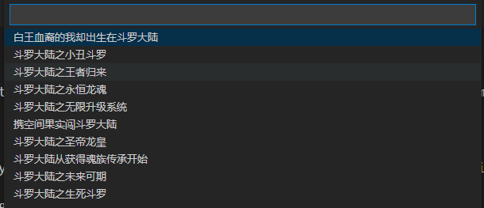
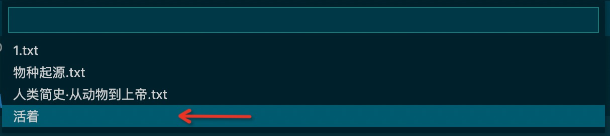
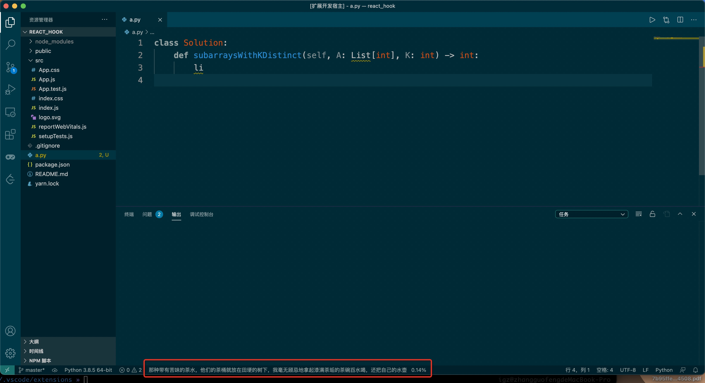
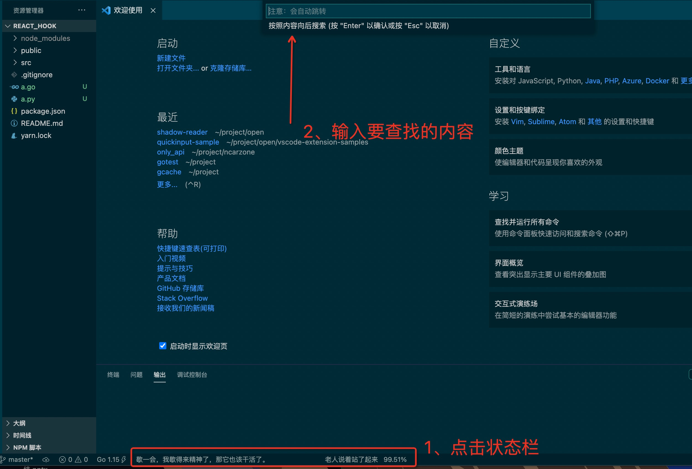
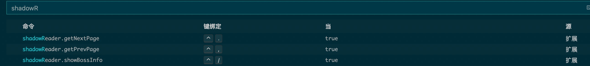
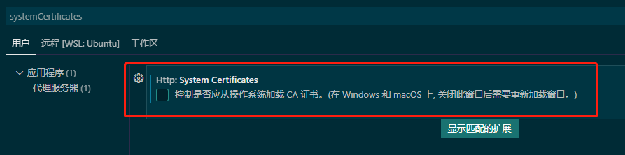

# shadow-reader-pro

vscode摸鱼看书插件，老板站在身后也不发现不了
## Statement
本插件的院所这已经不更新了，所以我下载了源码，修改后重新上架，如有侵权请联系我，稍后我也会开源该代码
## Features
- 支持状态栏显示
- 支持本地文本阅读
- 其他编码格式自动转码（支持格式GB18030、Big5、UTF-8、UTF-16、UTF-32等）
- 支持向后搜索内容
- 支持网络书籍（当前支持[笔趣阁](https://www.bq03.cc),删除了彩墨阁的支持，但是可以自定义源地址，目前仅支持一种解析方式，请自行查看解析方式后换源）

## Install
vscode插件市场，搜索`shadow reader pro`，安装

## Quick Start
### 主菜单（2选1）
1. ctrl+shift+p，搜索`shadowReader:开始工作`

2. 点击右上角的图标

主菜单如下

### 新增书籍
1. 选择`添加新书籍`
2. 本地书籍：选择`本地书籍`，选择文件，并起一个好记的名字吧

3. 网络书籍：选择`网络书籍`，搜索名字(*为随机几个)，选择对应书籍

### 开始阅读
1. 在主菜单选择`开始阅读`，选择刚添加的书名`活着`

2. 使用快捷键，上一页`alt+,`，下一页`alt+.`，老板键`alt+/`

### 删除书籍
1. 在主菜单选择`删除书籍`，选择书名`活着`，即可删除

### 自动老板键
1. 若长时间不操作，会自动使用老板键，当前显示文本为`Hello World`
2. 再次使用`alt+/`，可返回原文本

### 按内容向后搜索
1. 点击状态栏，输入搜索文本

## Extension Settings
* `shadowReader.pageSize`：每次最多显示字数（默认50）
* `shadowReader.onlineBookURL`：在线书源，当前已支持笔趣阁
* `shadowReader.hiddenTime`：自动切换至老板状态时间（单位秒，默认30）
* 修改快捷键：首选项 -- 键盘快捷方式

## Design Mind
- 专注vscode插件
- 专注隐蔽性、易用性

## Known Issues
- 上下一页的无反应（暂不清楚形成原因，可通过重新设置快捷键解决）
- 笔趣阁在梯子下无法访问（请关闭梯子即可）
- certificate expire [vscode issue](https://github.com/microsoft/vscode/issues/136787)，可通过禁用vscode证书验证实现

## Future Feature
- 其他格式支持(比如.epub)
- 其他隐藏显示手段

## Inspire
本插件灵感来自于[Thief-Book-VSCode](https://github.com/cteamx/Thief-Book-VSCode)，二者区别：  

区别  | Thief-Book-VSCode | shadow reader pro
---- | ---- | ----
大文件 | 全部加载 | 部分加载
支持编码 | utf8 | GB\Big5\UTF
支持书量 | 1本 | 多本
全文搜索 | 不支持 | 向后
在线书籍 | 不支持 | 支持
更新时间 | 2019 | 2021
